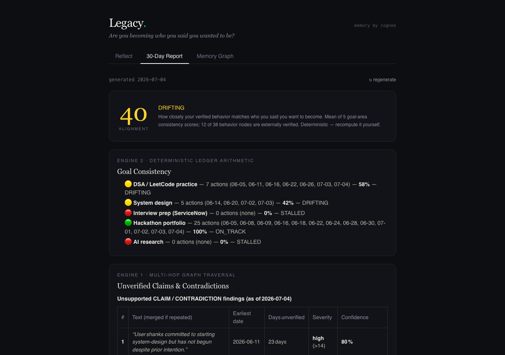
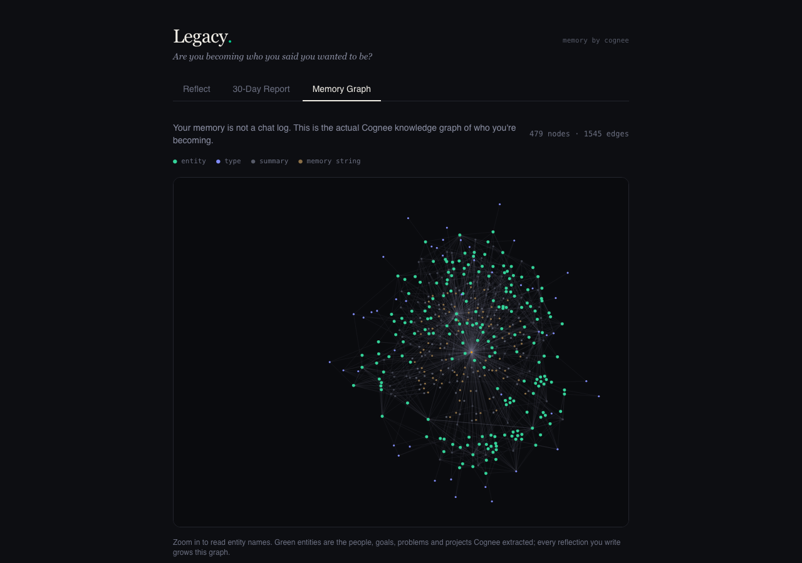
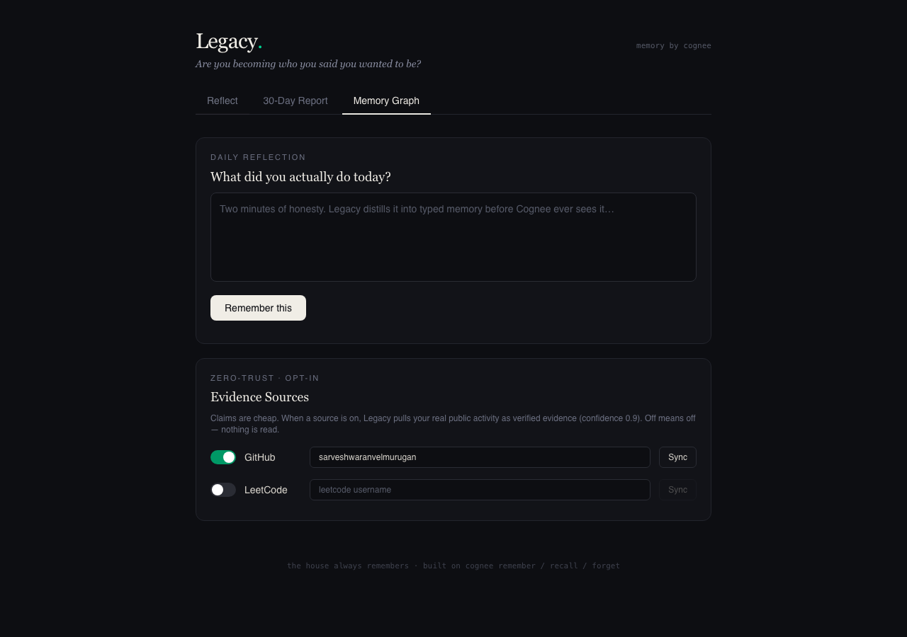

# Legacy.

### *Are you becoming who you said you wanted to be?*

**The Hangover Part AI: Where's My Context? — WeMakeDevs × Cognee Hackathon**

---

Every AI resets. Every session starts at zero. You've told your chatbot your goals fifty times and it remembers none of them — it woke up in Vegas, again.

**Legacy is a persistent life-trajectory agent.** It doesn't store your conversations — it builds a living knowledge graph of your evolving self on Cognee: your goals, actions, claims, evidence, and contradictions. Then it does the thing no journal, no chatbot, and no mentor-less student has ever had:

> **It catches you lying to yourself. With evidence. And it asks — never tells.**



<p align="center">
  
  
</p>

---

## What it does

You give Legacy a two-minute daily reflection. Legacy gives you back, over time:

| | |
|---|---|
| **Goal Consistency Scores** | Deterministic arithmetic over every action node — `hackathons 100% ON_TRACK · DSA 50% DRIFTING · interview prep 0% STALLED` |
| **Contradiction Report** | Claims with zero supporting evidence, ranked by days-unverified and severity, found by multi-hop graph traversal |
| **Behavioral Hypotheses** | *"You appear to be prioritizing building over your declared interview-prep goals — is this accurate?"* — 72% confidence, 11 supporting nodes, three buttons |
| **1-Year Projection** | An honest trajectory forecast: what completes, what stalls, what it costs you |
| **The Open Question** | The one question you're avoiding, asked directly |
| **Memory Graph** | your actual Cognee knowledge graph rendered live in-app — hundreds of nodes, force-directed, zoomable |
| **Evidence Sources** | opt-in toggles: GitHub pushes and LeetCode accepted solves synced as *verified* evidence (0.9) vs self-reported claims (0.3) |

And the part that matters most: **when you push back, the memory updates.** Respond "partially accurate — I've been reading papers offline" and Legacy extracts that correction into new nodes, recalibrates confidence, and its next answer reflects it. Memory that learns from being corrected.

## The agent lives in your terminal

```
$ ./legacy
Legacy. are you becoming who you said you wanted to be?
◉ observed: hangover (main) — 1 commit(s) today, 4 file(s) in progress → 1 node(s) remembered.
╭─ legacy remembers ──────────────────────────────────────────╮
│ • Currently working on the hackathon portfolio (AI-memory   │
│   system) … • Neglected: AI-research papers, mock interviews │
╰─────────────────────────────────────────────────────────────╯
╭─ legacy asks ───────────────────────────────────────────────╮
│ He is prioritizing technical implementation work over his   │
│ declared research and interview-preparation goals            │
│ 85% confidence · 10 supporting nodes                         │
╰─────────────────────────────────────────────────────────────╯
you › _
```

Open a terminal in any project and run `./legacy`. **Without being told, it looks
at where you are** — repo, branch, today's commits, uncommitted work — and
remembers it (git history = verified evidence). It primes itself from the graph,
asks the question it's been holding, then you just type: statements become
memory, questions are answered from memory. `/report` runs all engines inline.

## Other agents can remember through Legacy too

Every AI coding tool forgets you between chats — Legacy is the memory they share.
Hookups included for **MCP** ([`integrations/mcp/`](integrations/mcp) — Legacy's six memory
tools become *native* in Claude Code, Cursor, Claude Desktop; `./legacy setup` registers it),
**Claude Code skills** ([`integrations/claude-code/`](integrations/claude-code)),
**Cursor rules** ([`integrations/cursor/`](integrations/cursor)), and **any agent with a
terminal** ([`integrations/any-agent/AGENTS.md`](integrations/any-agent/AGENTS.md)). Then every new session can reach your memory:

- you ask a fresh chat *"what was I working on last week?"* → Claude runs
  `legacy ask …` and answers from your graph
- you tell it *"I finished the project"* → Claude logs it via `legacy remember …`
  and records the repo's git state as verified evidence via `legacy observe`

- you finish a project → `legacy learn` deep-studies it (metadata only: README,
  manifests, tree, commits — never source bodies) into PROJECT knowledge nodes
- weeks later, in a new session: *"build a new app following the patterns of
  app-a and app-b, combining both"* → Legacy returns each project's stack,
  architecture, features and patterns, plus a combined-build recommendation
  grounded in what you actually built

One-shot commands (`legacy ask | remember | observe | learn | report`) make Legacy a
memory layer any tool can call — your coding agent is amnesiac; your memory agent isn't.

## Why it's an agent, not an app

- **Perceives — ambiently and with consent.** The CLI observes your actual workspace (git) on every launch, unasked. Opt-in evidence sources (GitHub pushes, LeetCode solves) pull your real public activity as verified evidence (0.9) vs self-reported claims (0.3) — the graph knows the difference, and every source is a switch you control.
- **Maintains a world-model** — a typed, confidence-weighted knowledge graph on Cognee, persistent across every session.
- **Reasons** — five engines over that graph (contradiction, consistency, behavioral inference, projection, open question).
- **Acts on its own initiative** — after each reflection Legacy decides for itself whether enough new behavior has accumulated to challenge you with a fresh hypothesis. You don't ask it; it asks you.
- **Learns** — every confirmation/rejection/correction feeds calibration nodes back into the graph.

## Architecture

```
 user reflection ──► COMPACT MEMORY ENGINE (Claude Haiku 4.5)
                     raw text → 0-6 typed nodes; noise discarded
                          │
                          ▼   cognee.remember()  (add_text + cognify)
 ┌─────────────────────────────────────────────────────────────┐
 │                  COGNEE CLOUD MEMORY LAYER                  │
 │        hybrid graph-vector store · one graph per user       │
 │   GOAL · ACTION · CLAIM · EVIDENCE · CONTRADICTION nodes    │
 │   remember() · recall() · forget() · graph visualization    │
 └──────────────────────────┬──────────────────────────────────┘
                            │   cognee.recall() (GRAPH_COMPLETION)
                            ▼
        ┌──────────────┬──────────────┬──────────────┐
        │ Contradiction│ Behavioral   │ Future Self  │  + deterministic
        │ Engine       │ Inference    │ Simulator    │    Consistency
        │ (multi-hop)  │ (asks, never │ (1-yr        │    Scorer (local
        │              │  tells)      │  projection) │    node ledger)
        └──────┬───────┴──────┬───────┴──────┬───────┘
               ▼              ▼              ▼
                    THE 30-DAY REPORT
               │  user pushes back ("partially accurate…")
               ▼
        calibration nodes → cognee.remember() → graph recalibrates
                    ▲ memory that learns from correction
```

**Design decision worth noting:** narrative reasoning runs on Cognee's graph completion; consistency *scores* are exact arithmetic over a local ledger of every ingested node. Scores you can reproduce on stage, reasoning from the graph.

## Cognee API usage

| API | Where | Depth |
|---|---|---|
| `add_text` + `cognify` (= remember) | after every CME distillation, every calibration | typed memory strings, node sets, backdated timestamps that recall reasons over temporally |
| `recall` (GRAPH_COMPLETION) | all four narrative engines, each with a purpose-built system prompt and output contract | multi-hop claim↔evidence cross-referencing, temporal day-count arithmetic, domain clustering |
| `forget` | goal closure & privacy wipe | closure is recorded (why you moved on), not just deleted |
| graph endpoint | visualization | the graph explorer view of your evolving self |

## Stack

Cognee Cloud (memory) · Claude Haiku 4.5 (CME distillation, ~¼¢/reflection) · FastAPI · React + Vite + Tailwind v4

## Local setup

**Prerequisites:** Python 3.11+, Node 20+, a [Cognee Cloud](https://www.cognee.ai) account, an [Anthropic API key](https://console.anthropic.com).

**1. Clone and configure secrets**

```bash
git clone https://github.com/sarveshwaranvelmurugan/legacy.git
cd legacy
cp .env.example .env    # then fill in your real keys — .env is gitignored
```

Get the Cognee values from your Cognee Cloud dashboard → Connection Details
(API Base URL, Tenant ID, User ID, and an API key). Get the Anthropic key from
the Anthropic console — the CME runs on Haiku 4.5 and costs ~$0.003 per reflection.

**2. Backend** (FastAPI on :8400)

```bash
python3 -m venv .venv
.venv/bin/pip install -r backend/requirements.txt
cd backend
../.venv/bin/uvicorn app.main:app --port 8400 --reload
```

Sanity check: `curl http://localhost:8400/health` → `{"status":"ok", ...}`

**3. Frontend** (Vite + React on :5199, proxies `/api` → :8400)

```bash
cd frontend
npm install
npm run dev -- --port 5199    # → http://localhost:5199
```

**4. The terminal agent — then go full mode**

```bash
./legacy                                  # interactive: observes, primes, chats
./legacy setup                            # install the Claude Code skill globally
./legacy hook                             # run inside any project: wire Cursor + AGENTS.md
./legacy connect github <username>        # opt a source in (login)
./legacy connect leetcode <username>
./legacy sync                             # pull verified evidence from all connected sources
./legacy disconnect leetcode              # opt out (logout) — off means off
./legacy sources                          # connection status
```

The web app is optional — everything works from the CLI. Full reference: `./legacy help`.

| command | what it does |
|---|---|
| `legacy` | interactive session — observes your workspace, primes from memory, chats |
| `legacy ask <q>` | answer from your memory graph |
| `legacy remember <text>` | store a fact/milestone as typed memory |
| `legacy observe` | record this repo's git state as verified evidence |
| `legacy learn` | deep-study this project (metadata only, never source) |
| `legacy report` | alignment score, consistency, contradictions, projection |
| `legacy sources` / `connect` / `disconnect` / `sync` | opt-in evidence source management |
| `legacy autocapture on\|off` | auto-observe the workspace when a Claude Code session ends (default off) |
| `legacy setup` | full mode: Claude Code skill + MCP registration for this machine |
| `legacy hook` | wire the current project for Cursor + AGENTS.md agents |

**Auto-capture** (`legacy autocapture on`) closes the last manual step: a
Claude Code `SessionEnd` hook fires when any session ends and runs
`legacy observe` in that session's workspace — finish a project, close the
chat, Legacy already knows. Consent-first like everything else: default off,
one command to disable, and the hook reads only git metadata.

**5. Connecting to an existing Cognee dataset?** Rebuild the local score
ledger first: `cd backend && ../.venv/bin/python backfill_ledger.py`
(recording the demo? full runbook: [docs/DEMO_RUNNER_SETUP.md](docs/DEMO_RUNNER_SETUP.md))

**6. (Recommended) Seed the 30-day demo history**

A fresh graph is empty — the report engines need behavior to reason about.
This ingests 16 realistic backdated reflections (~16 Haiku calls, ≈5¢) and
builds the knowledge graph (takes a few minutes on Cognee's side):

```bash
cd backend && ../.venv/bin/python seed_demo.py
```

Then open http://localhost:5199, write a reflection in **Reflect**, and hit
**Generate 30-Day Report** — the first generation takes ~30s of graph traversal.

**Troubleshooting**

- *`recall` returns empty / report sections blank* — cognify is still processing;
  `curl http://localhost:8400/health`, wait a minute, regenerate.
- *DNS errors on a freshly created Cognee tenant* — brand-new tenant hostnames can
  take a while to propagate. `backend/app/config.py` contains a pinned-IP fallback;
  update the IP there if your tenant resolves elsewhere (`nslookup <your-tenant-host>`).
- *No pending hypothesis in the report* — Legacy only asks when it has seen enough
  new behavior. Force one: `curl -X POST http://localhost:8400/hypothesis/generate`

## AI tools declaration

Claude (Anthropic) was used as a development assistant throughout this project, and Claude Haiku 4.5 powers the runtime Compact Memory Engine. Architecture, system design, and product direction are original. Disclosed per hackathon rules.

---

*"The house always remembers. Now, so will you."*
